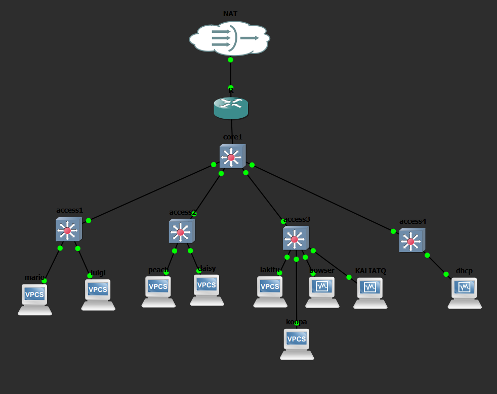
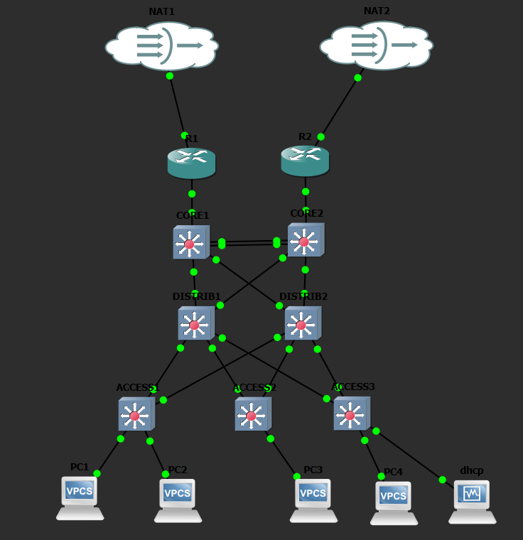

# TP Infrastructures Réseaux Sécurisées

Ce dépôt contient les travaux pratiques réalisés dans le cadre du cours B3 CS Infrastructures Réseaux Sécurisées.

## Topologies réseau

### TP1, TP2, TP3

Cette topologie met en place une infrastructure réseau segmentée en 4 VLANs :

- **VLAN 10** — admins (`10.1.10.0/24`)
- **VLAN 20** — clients (`10.1.20.0/24`)
- **VLAN 30** — servers (`10.1.30.0/24`)
- **VLAN 40** — guests (`10.1.40.0/24`)

Elle comprend un routeur Cisco (r1), un switch core (core1), quatre switches access (access1 à access4), des clients VPCS et des VMs Rocky Linux. Le routage inter-VLAN est assuré par la technique router-on-a-stick, avec un accès internet via NAT et un serveur DHCP dédié (dnsmasq).

---

### TP4

Cette topologie fait évoluer l'infrastructure vers une architecture 3-tier redondée :

- **VLAN 10** — clients (`10.3.10.0/24`)
- **VLAN 20** — admins (`10.3.20.0/24`)
- **VLAN 30** — servers (`10.3.30.0/24`)

Elle introduit la redondance à tous les niveaux : deux routeurs Cisco (r1, r2) avec HSRP pour la redondance de passerelle, deux switches core (core1, core2) reliés par un agrégat LACP, deux switches distribution (distrib1, distrib2), et trois switches access (access1 à access3).

---

## Contenu des TPs

| TP | Thématique |
|----|-----------|
| TP1 | Mise en place de l'infrastructure réseau (VLANs, routage inter-VLAN, NAT, DHCP) |
| TP2 | Attaques réseau (DHCP spoofing, starvation, ARP poisoning, DNS spoof) |
| TP3 | Durcissement L2 (DHCP snooping, DAI, IP Source Guard, STP protections) |
| TP4 | Redondance et durcissement (HSRP, LACP, ACL, protections L2/L3) |
